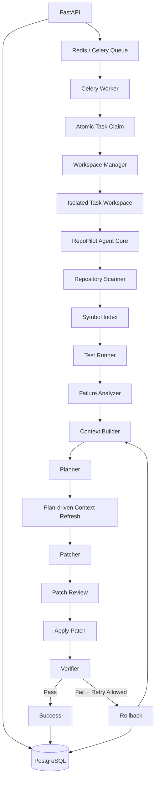
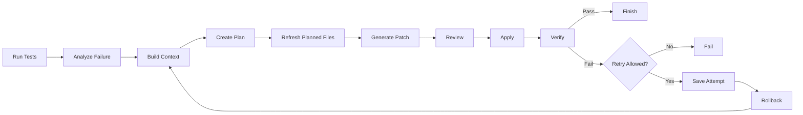

# RepoPilot

**RepoPilot** is a repository-level AI bug-fixing agent that combines a closed-loop repair workflow with an asynchronous task execution platform.

It is designed around a simple idea: a coding agent should not only generate a patch once. It should inspect repository context, run tests, analyze failures, propose a repair, verify the result, and use new test feedback when another iteration is needed.

RepoPilot also separates **agent evaluation** from **platform execution** so the repair loop can be benchmarked independently from infrastructure such as PostgreSQL, Redis, and Celery.

---

## What RepoPilot Does

Given a repository, an issue description, and a test command, RepoPilot can:

1. scan the repository and build a lightweight symbol index;
2. execute the existing tests and analyze failures;
3. select relevant source and test files;
4. build a repair plan;
5. generate and review a structured patch;
6. apply the patch inside an isolated workspace;
7. rerun tests to verify the repair;
8. retry with new failure feedback when allowed;
9. rollback failed iterations before the next repair attempt;
10. persist task, attempt, and trace information when running through the task platform.

---

## Architecture



RepoPilot has two intentionally separate layers:

### Agent Core

Responsible for repair quality:

- repository scanning;
- symbol indexing;
- test failure analysis;
- context selection;
- planning;
- structured patch generation;
- patch review;
- verification;
- retry and rollback.

### Task Platform

Responsible for execution reliability:

- FastAPI task submission;
- PostgreSQL persistence;
- Redis + Celery asynchronous execution;
- atomic task claiming;
- duplicate-delivery protection;
- isolated per-task workspaces;
- persisted attempts and trace events.

This separation makes it possible to benchmark the agent loop without mixing model quality with infrastructure failures.

---

## Repair Loop



A failed iteration is rolled back before the next attempt. Previous attempts and verification output are retained as feedback so later iterations can reason from new evidence without accumulating partially applied patches.

---

## Reliability Features

### Persistent Task State

Repair tasks, repair attempts, and trace events are persisted in PostgreSQL so execution state is not tied to a single API process.

### Asynchronous Workers

Long-running repair jobs are dispatched through Redis and Celery instead of blocking the API request lifecycle.

### Idempotent Task Execution

Workers atomically claim eligible tasks before executing them. Duplicate Celery deliveries for the same task do not cause the repair workflow to run repeatedly.

### Workspace Isolation

Each repair task operates on its own copied workspace, for example:

```text
runs/workspaces/task-<id>/
```

Concurrent tasks can target the same source repository without modifying the original repository or interfering with each other.

### Retry + Rollback

Failed repair attempts can be retried according to the retry policy. Before retrying, RepoPilot restores the repository snapshot from the start of the previous iteration.

### Traceability

The workflow records structured trace events for important stages such as:

- repository scan;
- initial test execution;
- failure analysis;
- context construction;
- plan generation;
- patch generation;
- patch application;
- verification;
- retry decisions;
- snapshot restoration;
- token/call summary.

This makes failed runs inspectable rather than opaque.

---

## Benchmarking

RepoPilot includes a **context-aware single-shot baseline** to evaluate whether the full agent loop provides value beyond one patch-generation attempt.

The two strategies intentionally share the same core components where possible:

| Component | Context Single-shot | RepoPilot Agent |
|---|---:|---:|
| Repository scan | Yes | Yes |
| Symbol index | Yes | Yes |
| Initial tests | Yes | Yes |
| Failure analysis | Yes | Yes |
| Context builder | Yes | Yes |
| Patch generator | Yes | Yes |
| Patch verification | Yes | Yes |
| LLM planning step | No | Yes |
| Multi-round retry | No | Yes |
| Rollback between retries | No | Yes |
| Test-feedback-driven next iteration | No | Yes |

### Basic benchmark

A representative run on six basic Python bug cases produced:

| Metric | Context Single-shot | RepoPilot Agent |
|---|---:|---:|
| Passed cases | 6 / 6 | 6 / 6 |
| Pass rate | 100% | 100% |
| Avg. model calls | 1.0 | 2.0 |
| Avg. tokens | 1,189.5 | 2,344.5 |
| Avg. duration | 4.03 s | 6.21 s |

The result is intentionally not presented as an Agent win. On simple bugs, a strong context-aware single-shot baseline can already solve the task with fewer calls, tokens, and lower latency.

Retry-sensitive cases are maintained separately to study when additional test feedback and multi-round repair become useful. Those cases are still exploratory and are **not used as a headline success-rate claim**.

### Run the benchmark

```powershell
python .\scripts\benchmark_compare.py
```

Run a specific case:

```powershell
python .\scripts\benchmark_compare.py --case staged_dynamic_rule
```

Benchmark results are written under:

```text
benchmark_runs/
```

Generated benchmark artifacts should normally remain outside version control.

> Note: token and model-call statistics are tracked directly. Provider pricing is not currently configured for all models, so `estimated_cost` may remain `0.0` even when the provider charges for API usage.

---

## Testing

Run the automated test suite:

```powershell
python -m pytest tests -q
```

The project includes tests around the repair workflow, retry behavior, context construction, workspace isolation, persistence behavior, API compatibility, and benchmark logic.

The benchmark suite is separate from the platform tests: benchmarks measure repair behavior, while persistence and worker infrastructure are validated independently.

---

## Project Structure

```text
repopilot-agent/
├── src/
│   └── repo_pilot/
│       ├── workflow.py
│       ├── context.py
│       ├── single_shot.py
│       ├── benchmark.py
│       ├── benchmark_cases.py
│       └── ...
│
├── scripts/
│   └── benchmark_compare.py
│
├── examples/
│   ├── buggy_calculator/
│   ├── buggy_off_by_one/
│   ├── buggy_staged_dynamic_rule/
│   └── ...
│
├── tests/
│   └── ...
│
├── runs/                # runtime traces / workspaces, ignored by Git
├── benchmark_runs/      # generated benchmark output, ignored by Git
└── README.md
```

---

## Design Decisions

### Why not send the whole repository to the model?

RepoPilot selects candidate files and snippets instead of blindly sending the complete repository. This keeps context focused and makes context-selection failures observable and improvable.

### Why rollback failed attempts?

A retry should start from a known repository state. Keeping partially successful patches between iterations makes later failures harder to reason about and can create accidental patch accumulation.

### Why keep Single-shot and Agent as separate strategies?

Without a baseline, additional planning and retry calls can look useful simply because more model tokens are being spent. The single-shot strategy provides a direct comparison for success rate, calls, tokens, and latency.

### Why separate benchmarks from Celery/PostgreSQL?

The benchmark asks:

> Can the repair strategy solve the bug?

The platform asks:

> Can repair jobs be executed reliably, asynchronously, and without task interference?

Keeping those questions separate makes failures easier to diagnose and metrics easier to interpret.

---

## Current Scope

RepoPilot currently focuses on repository-level Python repair workflows and engineering infrastructure around agent execution.

The project is intentionally **not presented as a production-ready autonomous coding system**. Current areas for future work include:

- larger and more diverse repair benchmarks;
- repeated benchmark runs for stochastic models;
- stronger runtime/dependency-based context expansion;
- provider-specific cost accounting;
- broader language support;
- production-grade sandboxing and resource limits;
- automated end-to-end infrastructure testing.

---

## Example Workflow

```text
Issue
  ↓
Repository Scan
  ↓
Initial Tests
  ↓
Failure Analysis
  ↓
Relevant Context
  ↓
Repair Plan
  ↓
Structured Patch
  ↓
Patch Review
  ↓
Apply in Isolated Workspace
  ↓
Verification
  ↓
PASS ───────────────→ Finish
  │
  └─ FAIL
      ↓
   Retry Decision
      ↓
    Rollback
      ↓
 New Test Feedback
      ↓
   Next Attempt
```

---

## Motivation

RepoPilot was built to explore both sides of coding-agent engineering:

1. **Agent quality** — context selection, planning, patch generation, verification, and feedback-driven repair.
2. **System quality** — asynchronous execution, persistence, isolation, idempotency, recovery, and observability.

The goal is not simply to call an LLM to generate code, but to make repository repair a measurable and inspectable software workflow.
