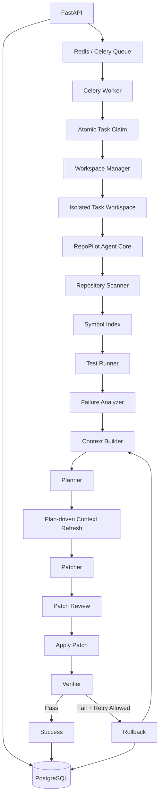
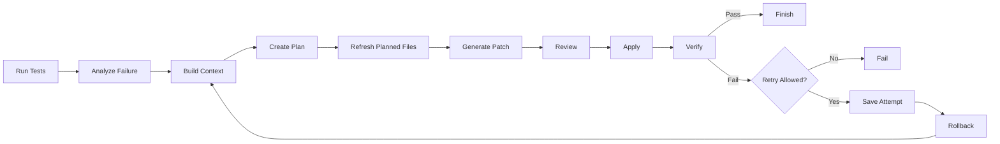

# RepoPilot

**RepoPilot** 是一个面向代码仓库级别 Bug 修复的 AI Agent 项目，结合了闭环修复工作流与异步任务执行平台。

项目的核心思路是：代码修复 Agent 不应该只调用一次大模型生成补丁，而应该能够读取仓库上下文、运行测试、分析失败原因、生成修复方案、验证结果，并在失败后利用新的测试反馈继续下一轮修复。

RepoPilot 同时将 **Agent 修复能力评测** 与 **任务执行基础设施** 分离，使得 Agent 本身可以独立进行 Benchmark，而不会把 PostgreSQL、Redis、Celery 等基础设施故障混入修复能力评测结果。

---

## 项目功能

给定一个代码仓库、Issue 描述和测试命令后，RepoPilot 可以完成：

1. 扫描代码仓库并构建轻量级 Symbol Index；
2. 执行现有测试并分析失败信息；
3. 选择相关源码文件和测试文件；
4. 生成修复计划；
5. 生成并审核结构化 Patch；
6. 在隔离 Workspace 中应用 Patch；
7. 重新运行测试验证修复结果；
8. 在允许 Retry 时利用新的测试反馈进入下一轮；
9. 失败后 Rollback 到本轮修改前的仓库状态；
10. 通过任务平台运行时，将 Task、Attempt 和 Trace 持久化。

---

## 系统架构



RepoPilot 主要分成两个层次。

### Agent Core

负责代码修复能力：

- Repository Scanner
- Symbol Index
- Test Failure Analysis
- Context Selection
- Planner
- Structured Patch Generation
- Patch Review
- Verification
- Retry / Rollback

### Task Platform

负责任务执行可靠性：

- FastAPI 任务提交
- PostgreSQL 持久化
- Redis + Celery 异步执行
- 原子任务领取
- 重复消息保护
- 独立 Workspace
- Repair Attempt / Trace 持久化

将两层分离后，可以独立评估 Agent 的代码修复能力，而不会把基础设施异常误认为模型修复能力问题。

---

## Agent 修复流程



每次 Repair Iteration 失败后，RepoPilot 会恢复到该轮修改前的仓库快照。

同时会保存前一轮的：

- Patch Diff
- Verification Output
- Failure Type
- Retry Decision

下一轮可以利用这些历史信息继续推理，而不会在已经被部分修改的代码上不断叠加补丁。

---

## 可靠性设计

### PostgreSQL 持久化

Repair Task、Repair Attempt 和 Trace Event 都可以持久化到 PostgreSQL。

这样任务状态不会依赖单个 API 进程的生命周期。

### Redis + Celery 异步执行

耗时较长的 Repo Repair Job 通过 Redis 和 Celery Worker 异步处理，而不是阻塞 FastAPI 请求。

### 幂等任务执行

Worker 在执行任务前通过原子状态更新领取任务。

同一个 RepairTask 即使被 Celery 重复投递，也不会重复执行 Workflow。

### Workspace Isolation

每个 RepairTask 都会拥有独立 Workspace，例如：

```text
runs/workspaces/task-<id>/
```

因此多个任务即使同时修复同一个源仓库，也不会：

- 修改原始 Repo；
- 相互覆盖文件；
- 共享未完成的 Patch 状态。

### Retry + Rollback

当 Repair Attempt 失败且满足 RetryPolicy 时，RepoPilot 可以继续下一轮修复。

进入下一轮前会恢复 Repository Snapshot，从已知一致状态重新开始。

### Trace 可观测性

Workflow 会记录结构化 Trace Event，包括：

- Repository Scan
- Initial Test
- Failure Analysis
- Context Build
- Plan Generation
- Patch Generation
- Patch Apply
- Verification
- Retry Decision
- Snapshot Restore
- Model Call / Token Summary

因此失败任务可以被追踪和分析，而不是只得到一个最终的 `FAILED` 状态。

---

## Benchmark

真实 Python 缺陷案例可通过 [BugsInPy Adapter](docs/bugsinpy.md) 转换为
`BenchmarkCase`，复用现有 `EvalRunner`。

自动执行 checkout、compile、复现、两种修复策略和独立验收，见
[BugsInPyRunner](docs/bugsinpy_runner.md)。

RepoPilot 实现了一个 **Context-aware Single-shot Baseline**，用于判断完整 Agent Workflow 是否真的比单轮 Patch Generation 更有价值。

Single-shot 和 Agent 尽可能共享相同组件：

| 能力 | Context Single-shot | RepoPilot Agent |
|---|---:|---:|
| Repository Scan | Yes | Yes |
| Symbol Index | Yes | Yes |
| Initial Tests | Yes | Yes |
| Failure Analysis | Yes | Yes |
| Context Builder | Yes | Yes |
| Patch Generator | Yes | Yes |
| Patch Verification | Yes | Yes |
| LLM Planner | No | Yes |
| Multi-round Retry | No | Yes |
| Rollback | No | Yes |
| Test Feedback 驱动下一轮 | No | Yes |

### 基础 Benchmark

在 6 个基础 Python Bug Case 的一次代表性运行中：

| 指标 | Context Single-shot | RepoPilot Agent |
|---|---:|---:|
| 通过 Case | 6 / 6 | 6 / 6 |
| Pass Rate | 100% | 100% |
| 平均 Model Calls | 1.0 | 2.0 |
| 平均 Tokens | 1,189.5 | 2,344.5 |
| 平均耗时 | 4.03 s | 6.21 s |

这个结果并不意味着 Agent 在简单任务上更好。

相反，它说明：

> 对于简单 Bug，拥有良好 Context 的 Single-shot Baseline 已经能够完成修复，而完整 Agent 会产生额外的模型调用、Token 和延迟。

因此 RepoPilot 将 Retry-sensitive Case 单独用于分析：

- Test Feedback
- Retry
- Rollback
- Multi-round Repair

在什么情况下能够带来额外价值。

目前这部分 Case 仍属于探索性评测，因此项目不会使用它们来宣称未经充分验证的成功率提升。

### 运行 Benchmark

运行全部 Benchmark：

```powershell
python .\scripts\benchmark_compare.py
```

运行指定 Case：

```powershell
python .\scripts\benchmark_compare.py --case staged_dynamic_rule
```

Benchmark 输出保存在：

```text
benchmark_runs/
```

这些运行产物默认不应该提交到 Git。

> 注意：项目目前可以记录 Model Calls 和 Token Usage，但并未为所有 Provider 配置价格，因此 `estimated_cost` 可能显示为 `0.0`。这不代表 API 调用本身免费。

---

## 测试

运行自动化测试：

```powershell
python -m pytest tests -q
```

测试覆盖的主要能力包括：

- Repair Workflow
- Retry / Rollback
- Context Construction
- Workspace Isolation
- Persistence
- API Compatibility
- Benchmark Logic

Benchmark 与 Platform Test 是两套不同的验证体系：

```text
Benchmark
→ 评估 Agent 修复能力

Platform / Integration Tests
→ 验证任务持久化、并发、幂等和隔离
```

---

## 项目结构

```text
repopilot-agent/
├── src/
│   └── repo_pilot/
│       ├── workflow.py
│       ├── context.py
│       ├── single_shot.py
│       ├── benchmark.py
│       ├── benchmark_cases.py
│       └── ...
│
├── scripts/
│   └── benchmark_compare.py
│
├── examples/
│   ├── buggy_calculator/
│   ├── buggy_off_by_one/
│   ├── buggy_staged_dynamic_rule/
│   └── ...
│
├── tests/
│   └── ...
│
├── runs/                # Runtime Trace / Workspace，Git 忽略
├── benchmark_runs/      # Benchmark 结果，Git 忽略
└── README.md
```

---

## 关键设计决策

### 为什么不直接把整个 Repository 全部发送给 LLM？

RepoPilot 会先选择 Candidate Files 和相关代码片段，而不是把整个 Repo 无差别塞入 Prompt。

这样可以：

- 减少无关 Context；
- 降低 Token 消耗；
- 让 Context Retrieval 本身可以被分析和优化；
- 更容易发现“模型失败”究竟是不是因为缺少源码上下文。

### 为什么失败后要 Rollback？

Retry 应该从一个确定的 Repository State 开始。

如果保留失败轮次中的部分 Patch，下一轮可能出现：

- Patch 状态叠加；
- Failure Cause 难以判断；
- 前后 Iteration 不可比较。

因此 RepoPilot 默认恢复到本轮开始前的 Snapshot，再执行下一轮完整修复。

### 为什么需要 Single-shot Baseline？

如果没有 Baseline，仅仅增加 Planner、Retry 和更多 Token，也可能看起来像“Agent 更强”。

因此 RepoPilot 使用 Context-aware Single-shot 作为对照，比较：

- Success Rate
- Model Calls
- Tokens
- Latency

从而判断 Agent Loop 是否真正产生额外价值。


## 当前范围

RepoPilot 当前主要聚焦 Python Repository 的自动 Bug Repair，以及 Agent Execution 所需的基础设施。

项目目前不会将自己描述为生产级 Autonomous Coding System。

后续可以继续扩展：

- 更大规模、更复杂的 Repair Benchmark；
- 对随机模型进行多次重复评测；
- 更强的 Runtime Dependency / Dynamic Context Expansion；
- Provider-specific Cost Accounting；
- 多语言代码支持；
- 更严格的 Sandbox 和 Resource Limit；
- 自动化 End-to-End Infrastructure Testing。

---

## 示例执行链路

```text
Issue
  ↓
Repository Scan
  ↓
Initial Tests
  ↓
Failure Analysis
  ↓
Relevant Context
  ↓
Repair Plan
  ↓
Structured Patch
  ↓
Patch Review
  ↓
Apply in Isolated Workspace
  ↓
Verification
  ↓
PASS ───────────────→ Finish
  │
  └─ FAIL
      ↓
   Retry Decision
      ↓
    Rollback
      ↓
 New Test Feedback
      ↓
   Next Attempt
```

---

## 项目目标

RepoPilot 主要用于探索 Coding Agent 的两个核心问题。

### Agent Quality

关注：

- Context Selection
- Planning
- Patch Generation
- Verification
- Test Feedback
- Multi-round Repair

### System Quality

关注：

- Asynchronous Execution
- Persistence
- Workspace Isolation
- Idempotency
- Failure Recovery
- Observability

项目目标不是简单封装一次 LLM API 调用，而是把 Repository Repair 构建成一个：

**可执行、可验证、可恢复、可观测、可评测的 Agent Workflow。**
